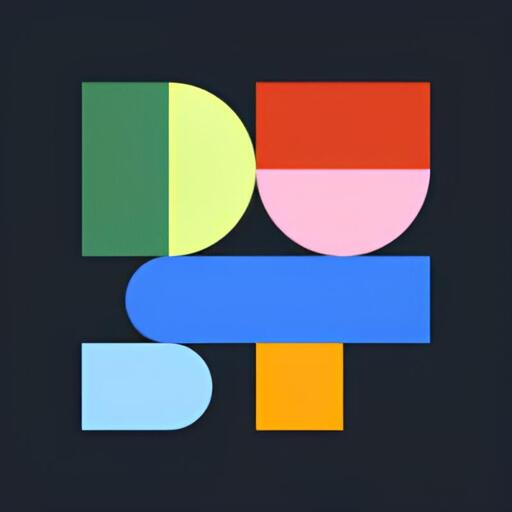

<h1>Dust AI</h1>

Client desktop macOS pour <a href="https://dust.tt">Dust AI</a>

## Téléchargement

Une version compilée est disponible directement dans les [**Releases**](https://github.com/SupraMK/dust-ai-desktop/releases) — aucune installation de Node.js requise.

---

## Aperçu

Application desktop macOS encapsulant [app.dust.tt](https://app.dust.tt), tray icon, raccourci global et session persistante.

---

## Raccourcis

| Raccourci | Action |
|---|---|
| `⌘ Shift D` | Afficher / Masquer |
| `⌘ R` | Recharger |
| `⌘ Q` | Quitter |
